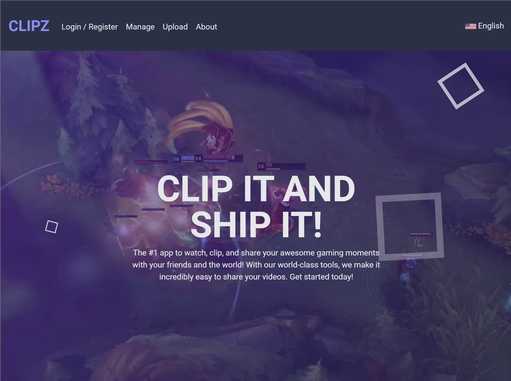

# CLIPZ: AN ANGULAR & FIREBASE PROGRAM

By Reed Meher | 2024

## TABLE of CONTENTS

- [Summary](#summary)
- [Languages, Framework, and tech](#languages-framework--tech)
- [How to Use](#how-to-use-the-program)
- [Future Development and Improvement](#future-development-and-improvement)
- [About the Author](#about-the-author)

## SUMMARY

Clipz has been a massive undertaking to implement many tools and get at every corner of Angular (pun intended). It allows users to create accounts, view gaming videos others have uploaded, and upload their own short gaming videos.

<!-- [Visit deployed application]() -->

## LANGUAGES, FRAMEWORK, & TECH

- Angular | v17
- TypeScript
- TailWindCSS
- HTML
- WebAssembly

## HOW TO USE

## FUTURE DEVELOPMENT and IMPROVEMENT

## ABOUT the AUTHOR

Reed Meher is a web developer based in Minnesota. See his portfolio at [meherdevs.com](https://www.meherdevs.com), follow him on [LinkedIn](https://www.linkedin.com/in/reed-meher), or reach out with questions via [email](mailto:reed@meherdevs.com).

---

Made with ❤️ by Reed Meher | 2024
